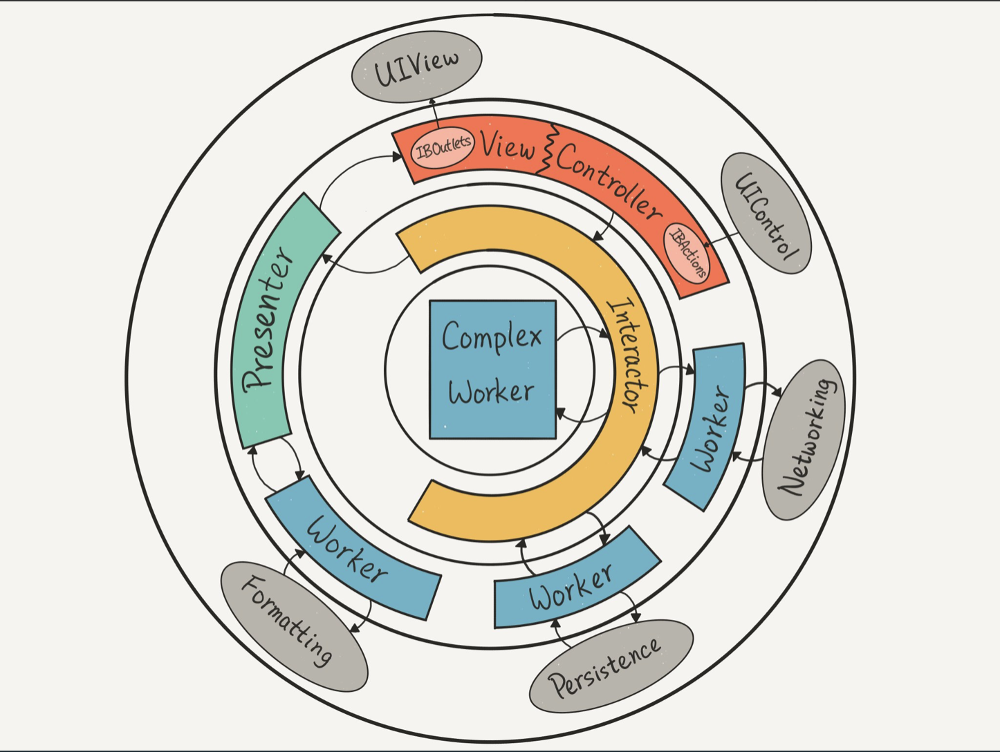
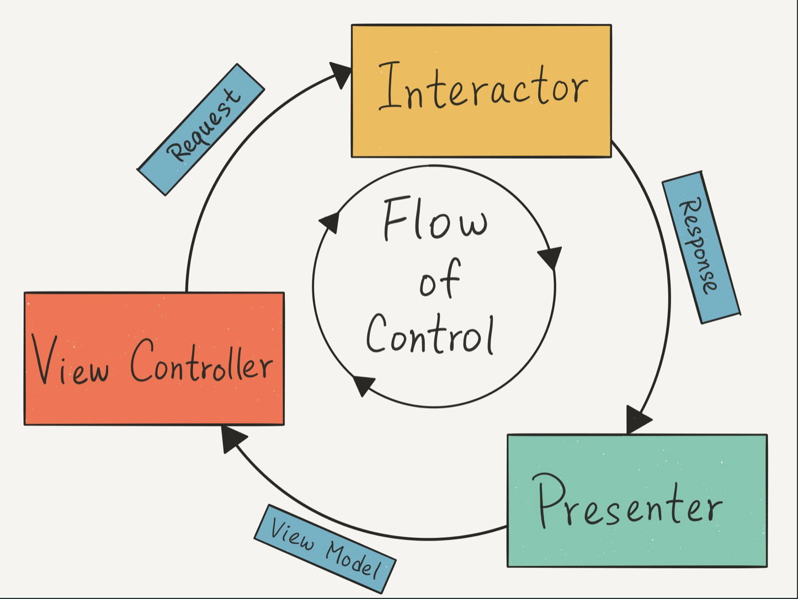
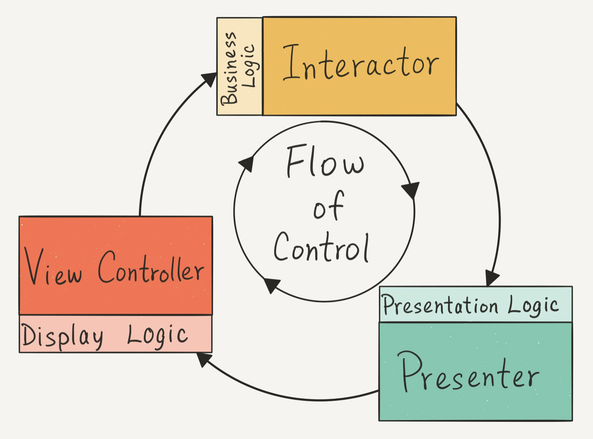
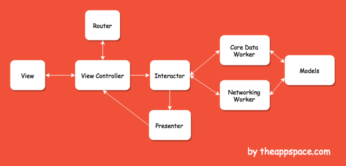

# Clean Swift

Main rules:

- Every manager, provider, etc. is considered as "Worker"

- Every worker has its protocol which defines "public" methods and properties and hence testable behaviours.

	"Public" in this case doesn't mean modifier but availabilit for utilizers of the Worker. This protocol provides behaviours used outside the buisness logic, testable, and public. Methods and properties not included in protocols are considered private regardless of their modifiers (public, internal, etc.). This may allow this entities to be available for subclasses and other cooperating objects, but unavailable for the objects which utilize the Workers. But it would be better if cooperating objects use other protocols tailored for them.
	
- Never embed texts of labels in custom Views/Controls. Content should allways be loaded from one place (presenter) and this is the place where texts should be localized.

## Why not VIPER

VIPER is bad because in viper there is **View <-> Presenter <-> Interactor** data flow, which means that presenter is a highway between View and Interactor, which also means much more boilerplate code to pass around the information.

In Clean Swift approach there is a circle flow **View -> Interactor -> Presenter -> View** which means that interactor is responsible for handling of user actions, and presenter is responsible only for presentation logic (the result), and there is also display logic which is located in the View itself. This means that presenter doesn't have to handle and forward user actions, and we have to write much less code.
	
## Router vs Coordinator
source: https://appunite.com/blog/ios-mvvm-you-do-it-wrong

> There are two commonly used objects - Router and Coordinator. Both of them are valid solutions, they make some parts of unit tests very simple, however, there is one key difference - **router manages routing from a single instance** of the view controller, while **coordinator takes care of entire flow**. Which one is better? As always - there is no silver bullet solution that will fit all applications. If your app has a lot of independent screens, which can be presented in different contexts - you should probably use routers, if it has screens that can be grouped into few controllers-long flows - coordinators might be the better solution.

So in most cases we will use Routers to manage independent screens. But in case like Authentication where is flow composed form several steps (controllers, screens) it's better to use Coordinator for managing entire flow.

## Raymond Law's Diagrams

source: https://twitter.com/rayvinly

#### Layers

#### Flow of control

#### VIP Cycle

### Other Diagrams

Source (article): [Introducing Clean Swift Architecture (VIP)](https://hackernoon.com/introducing-clean-swift-architecture-vip-770a639ad7bf)

## Testing

- ViewControllerTests - https://clean-swift.com/how-to-test-your-viewdidload-method/